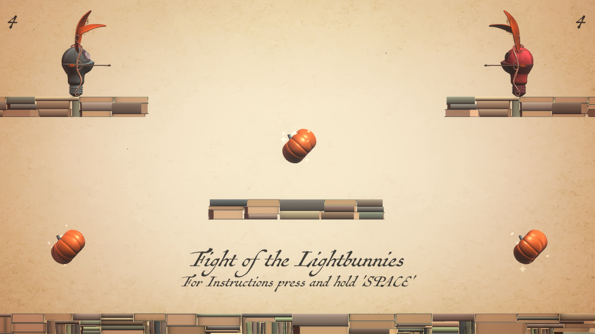
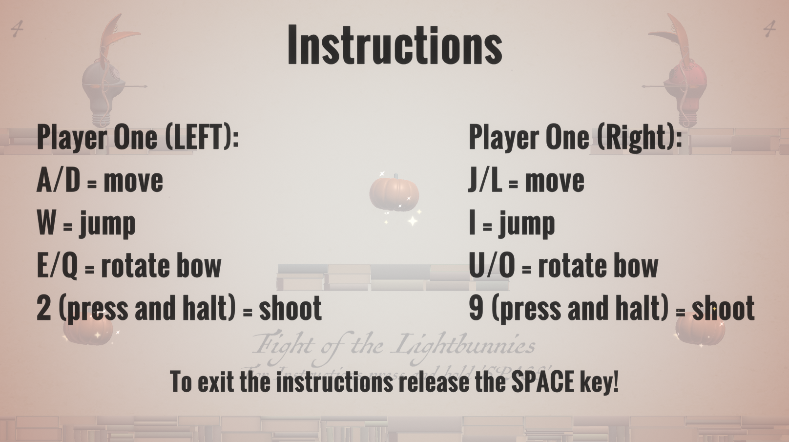
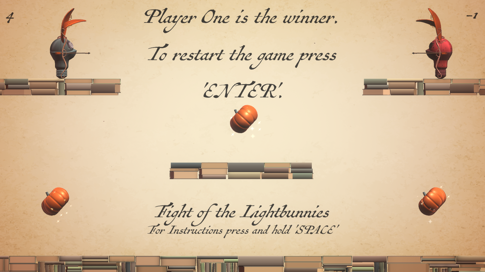

# game-Worms-Lhelbok

### Project description: 

Game where light bunnys can shoot each other with bows and arrows. 
Two player game, the task is to shoot at your enemy bunny four times to win the game.
 With the magic pumpkins you can receive extra points the first round.

The game can be played with this link: https://3ahmnm-htlsbg.github.io/game-Worms-Lhelbok/index.html

### Development platform: 

- Unity 2019.1.14f1
- Visual Studio Community
- Windows 10 Home
- MonoDevelop v5.9.6;
- Scripting Runtime Version: 4.X;

### Target platform: 
WebGL 1920x1080

### Visuals: 

#### Executed Program

#### Instruction Manual

#### Endscreen with displayed winner

### Necessary setup/execution steps: 

WebGL has to be installed and stable internet connection is necessairy

### Third party material: 
template for the README by smeerws

### Project state: 
100%

### Limitations: 
None

### Lessons Learned: 

- How to instantiate objects
- That a method can be applied to a key
- How to code an object into shooting something
- That a method from another script can be called

Copyright by Lhelbok